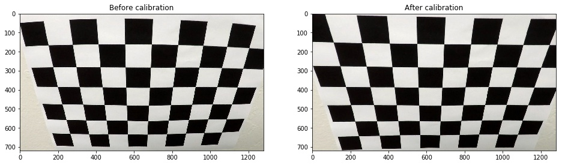
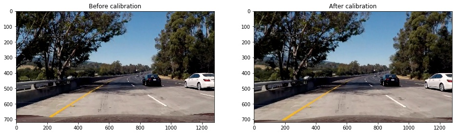
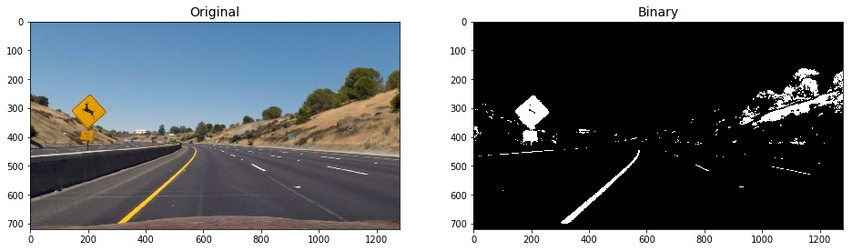
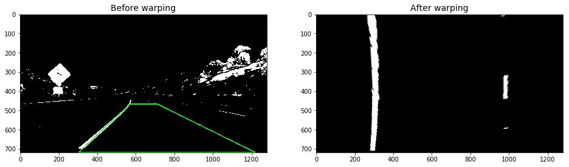
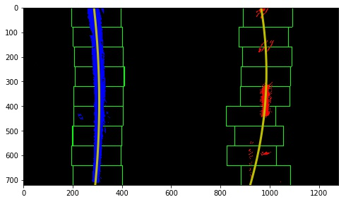
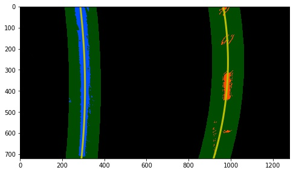
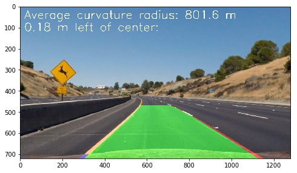

## **Advanced Lane Finding**
Harutaka Kawamura

---

The goals / steps of this project are the following:

* Compute the camera calibration matrix and distortion coefficients given a set of chessboard images.
* Apply a distortion correction to raw images.
* Use color transforms, gradients, etc., to create a thresholded binary image.
* Apply a perspective transform to rectify binary image ("birds-eye view").
* Detect lane pixels and fit to find the lane boundary.
* Determine the curvature of the lane and vehicle position with respect to center.
* Warp the detected lane boundaries back onto the original image.
* Output visual display of the lane boundaries and numerical estimation of lane curvature and vehicle position.

## [Rubric](https://review.udacity.com/#!/rubrics/571/view) Points

### Here I will consider the rubric points individually and describe how I addressed each point in my implementation.  

---

### Writeup / README

#### 1. Provide a Writeup / README that includes all the rubric points and how you addressed each one.  You can submit your writeup as markdown or pdf.  [Here](https://github.com/udacity/CarND-Advanced-Lane-Lines/blob/master/writeup_template.md) is a template writeup for this project you can use as a guide and a starting point. 

You're reading it!

### Camera Calibration

#### 1. Briefly state how you computed the camera matrix and distortion coefficients. Provide an example of a distortion corrected calibration image.

The code for this step is contained in the first code cell of the IPython notebook located in "P2.ipynb".

I start by preparing "object points", which will be the (x, y, z) coordinates of the chessboard corners in the world. Here I am assuming the chessboard is fixed on the (x, y) plane at z=0, such that the object points are the same for each calibration image.  Thus, `objp` is just a replicated array of coordinates, and `objpoints` will be appended with a copy of it every time I successfully detect all chessboard corners in a test image.  `imgpoints` will be appended with the (x, y) pixel position of each of the corners in the image plane with each successful chessboard detection.  

I then used the output `objpoints` and `imgpoints` to compute the camera calibration and distortion coefficients using the `cv2.calibrateCamera()` function.  I applied this distortion correction to the test image using the `cv2.undistort()` function and obtained this result: 



### Pipeline (single images)

#### 1. Provide an example of a distortion-corrected image.

The effect of calibration is very subtle.


#### 2. Describe how (and identify where in your code) you used color transforms, gradients or other methods to create a thresholded binary image.  Provide an example of a binary image result.

I used a combination of color and gradient thresholds to generate a binary image (the function `binarize`).  Here's an example of my output for this step.



#### 3. Describe how (and identify where in your code) you performed a perspective transform and provide an example of a transformed image.

**Warp source**<br>
For the first frame, I used the pipeline function I implemented in the 1st project (`pipeline_P1`) to compute the vetrices of an area to be warped.

After the first frame, I used the vetrices of the previous lane area calculated by the function `unwarp` so the warp source is updated and adjusted to fit the lane lines frame by frame.

**Warp distination**<br>
```python
def calc_warp_dst(img_shape):
	h, w = img_shape[:2]
	margin_x = 300
	margin_y = 0
	dst = np.array([
		[margin_x, margin_y],
		[w - margin_x, margin_y],
		[w - margin_x, h - 1],
		[margin_x, h - 1]], dtype="float32")
	return dst
```

The green polygon represents an area to be warped.


#### 4. Describe how (and identify where in your code) you identified lane-line pixels and fit their positions with a polynomial?

**Lane-line pixel detection**<br>
For the first frame, I used the sliding window technique introduced in the lesson with the following parameters.
- y_split: 9
- Margin: 100

After the first frame, I used the previous fitting lines and find lane-line pixels around them.


**Lane-line fitting**<br>
I used the 2nd order polynomial to fit the lane line pixels. 

For the first frame<br>


After the first frame<br>


#### 5. Describe how (and identify where in your code) you calculated the radius of curvature of the lane and the position of the vehicle with respect to center.

```python
def calc_curvrad(leftx_fit, rightx_fit, y):
    """   
    Calculate the radius of curvature of left and right lane lines and take the average of them
    """   
    ym_per_pix = 30/720
    xm_per_pix = 3.7/700
    left_p = np.polyfit(y*ym_per_pix, leftx_fit*xm_per_pix, 2)
    right_p = np.polyfit(y*ym_per_pix, rightx_fit*xm_per_pix, 2)
    left_curvrad = ((1 + (2*left_p[0]*y[-1]*ym_per_pix + left_p[1])**2)**1.5) / np.abs(2*left_p[0])
    right_curvrad = ((1 + (2*right_p[0]*y[-1]*ym_per_pix + right_p[1])**2)**1.5) / np.abs(2*right_p[0])
    ave_curvrad = np.average((left_curvrad, right_curvrad))
    return ave_curvrad

def calc_offset(leftx_fit, rightx_fit, img_shape):
    """
    Calculate offset from the image center
    """   
    lane_center = (leftx_fit[-1] + rightx_fit[-1])/2  
    xm_per_pix = 3.7/700
    center_offset = (xm_per_pix * np.abs(lane_center - img_shape[1]/2))
    direction = 'right' if (lane_center - img_final.shape[1]/2) > 0 else 'left'
    return center_offset, direction
```

#### 6. Provide an example image of your result plotted back down onto the road such that the lane area is identified clearly.

I implemented this step as the function `unwarp`.



---

### Pipeline (video)

#### 1. Provide a link to your final video output.  Your pipeline should perform reasonably well on the entire project video (wobbly lines are ok but no catastrophic failures that would cause the car to drive off the road!).

Here's a [link to my video result](./project_video_processed.mp4)

---

### Discussion

#### 1. Briefly discuss any problems / issues you faced in your implementation of this project.  Where will your pipeline likely fail?  What could you do to make it more robust?

-  Tuning threshold values to generate a good binary image was the hardest for me. I hardcoded these parameters for the project video. However, if we had an algorithm to adjust them automatically, that could improve the robustness of detection.