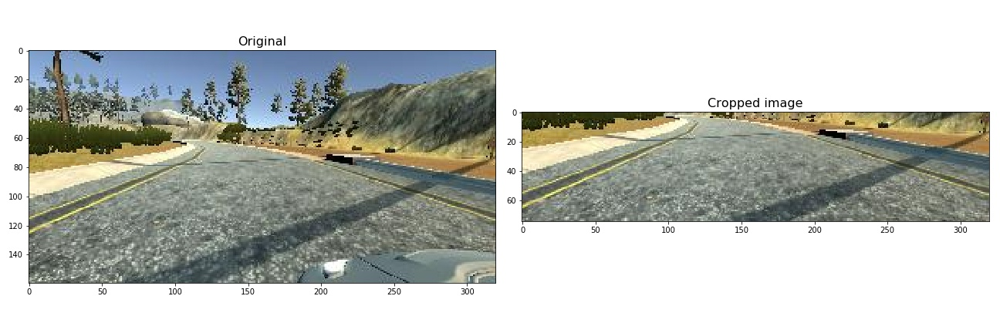

# **Behavioral Cloning** 

## Writeup Template

### You can use this file as a template for your writeup if you want to submit it as a markdown file, but feel free to use some other method and submit a pdf if you prefer.

---

**Behavioral Cloning Project**

The goals / steps of this project are the following:
* Use the simulator to collect data of good driving behavior
* Build, a convolution neural network in Keras that predicts steering angles from images
* Train and validate the model with a training and validation set
* Test that the model successfully drives around track one without leaving the road
* Summarize the results with a written report


## Rubric Points
### Here I will consider the [rubric points](https://review.udacity.com/#!/rubrics/432/view) individually and describe how I addressed each point in my implementation.  

---
### Files Submitted & Code Quality

#### 1. Submission includes all required files and can be used to run the simulator in autonomous mode

My project includes the following files:
* model.py containing the script to create and train the model
* drive.py for driving the car in autonomous mode
* model.h5 containing a trained convolution neural network 
* writeup.md summarizing the results
* autodrive.mp4 video in autonomous mode

#### 2. Submission includes functional code
Using the Udacity provided simulator and my drive.py file, the car can be driven autonomously around the track by executing 
```sh
python drive.py model.h5
```

#### 3. Submission code is usable and readable

The model.py file contains the code for training and saving the convolution neural network. The file shows the pipeline I used for training and validating the model, and it contains comments to explain how the code works.

### Model Architecture and Training Strategy

#### 1. An appropriate model architecture has been employed

My model consists of a convolution neural network with 3x3 filter sizes and depths between 64 and 512 (model.py lines 79-96) 

The model includes RELU layers to introduce nonlinearity, and the data is normalized and cropped in the model using a Keras Lambda and Cropping2D layer (code line 86 and 87).

#### 2. Attempts to reduce overfitting in the model

The model contains dropout layers in order to prevent overfitting (model.py lines 89). 

The model was trained and validated on different data sets to ensure that the model was not overfitting (code line 122). The model was tested by running it through the simulator and ensuring that the vehicle could stay on the track.

#### 3. Model parameter tuning

The model used an Adam optimizer with learning rate=1e-4.

#### 4. Appropriate training data

Training data was chosen to keep the vehicle driving on the road. I used a combination of center lane driving and counter-clockwise driving. 

For details about how I created the training data, see the next section. 

### Model Architecture and Training Strategy

#### 1. Model Architecture

I used the pretrained VGG19 as a base feature extractor and add four fully connected layers on top of that. First, the input image is cropped removing 60 pixels from the top and 25 pixels from the bottom. This prevents the model from getting distracted by sky or trees in the background, and the hood of the car. Then, the cropped image is normalized between -1 and 1 to speep up learning. I used Keras Lambda and Cropping2D to perform these operations.


|Layer     |Description|
|:---------|:----------|
|Input     |Input RGB image (160, 320, 3)|
|Lambda    |Normalize the input image by (x - 127.5) - 0.5|
|Cropping2D|Crop the input image and remove the sky and hood of the car|
|VGG19     |pretrained VGG19 withtout fully connected layers|
|Dropout   |activation: relu, output shape: (2, 10, 512)|
|Flatten   |output shape: 10240|
|Dense     |activation: relu, output shape: 128|
|Dense     |activation: relu, output shape: 64|
|Dense     |activation: relu, output shape: 32|
|Dense     |activation: None, output shape: 1|


Preprocessed Image



#### 3. Creation of the Training Set & Training Process

To capture good driving behavior, I first recorded three laps on track one using center lane driving. Here is an example image of center lane driving:


Then I recorded three laps driving counter-clockwise. Here is an example image of counter-clockwise driving:


To augment the data sat, I applied the following two transformations:
1. Random flip
2. Random horizontal and vertical shift (range: -10~10 pixels)

Here is an example augmented image:


After the collection process, I had 23934 number of data points. I preprocessed this data by adjusting a steering value for left and right camera images to stablized the performance.
- Left camera image: add 0.2
- Right image: add -0.2


I finally randomly shuffled the data set and put 20% of the data into a validation set. 

I used this training data for training the model. The validation set helped determine if the model was over or under fitting. The ideal number of epochs was 10 as evidenced by the training history below. The validation loss looks stablized after 10 epochs.


