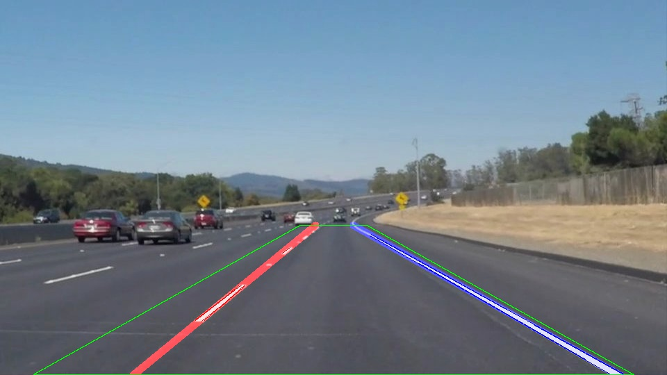

# **Finding Lane Lines on the Road** 

**Finding Lane Lines on the Road**

The goals / steps of this project are the following:
* Make a pipeline that finds lane lines on the road
* Reflect on your work in a written report

### Example

---

## Reflection

### 1. Describe your pipeline. As part of the description, explain how you modified the draw_lines() function.

I kept draw_lines as it is. Instead, I defined two helper functions, `sperate_lines` and `fit_lines`. I'll explain how they work below.

### separate_lines
This function seprates line segments into left and right ones using their slopes.

### fit_lines
This function fits line segments and compute linear confficients of the line passing through the line segments. 

## Pipeline
My pipeline consists of the following 9 steps.

1. Extract yellow and white pixels by masking the input image in the HLS color space.
2. Convert it to grayscale
3. Apply the Gaussian blur to remove noises
4. Apply the Canny edge detection
5. Extract ROI
6. Apply the Hough transform to extract line segments
7. Remove outliers
8. Seprate the line segments into left and right ones by their slopes
9. Fitting line segments

### Input

### Output

- Green Line: ROI
- Red Line: left lane line
- Blue Line: right lane line

## 2. Identify potential shortcomings with your current pipeline
In the sample videos, there is no car running right in front of you, but if a car (especially yellow or white colored) does, it affects the accuracy of detection significantly.

## 3. Suggest possible improvements to your pipeline
I used **fixed** ROI but it might be better to make ROI adaptive and update it using detected lane lines frame by frame.
