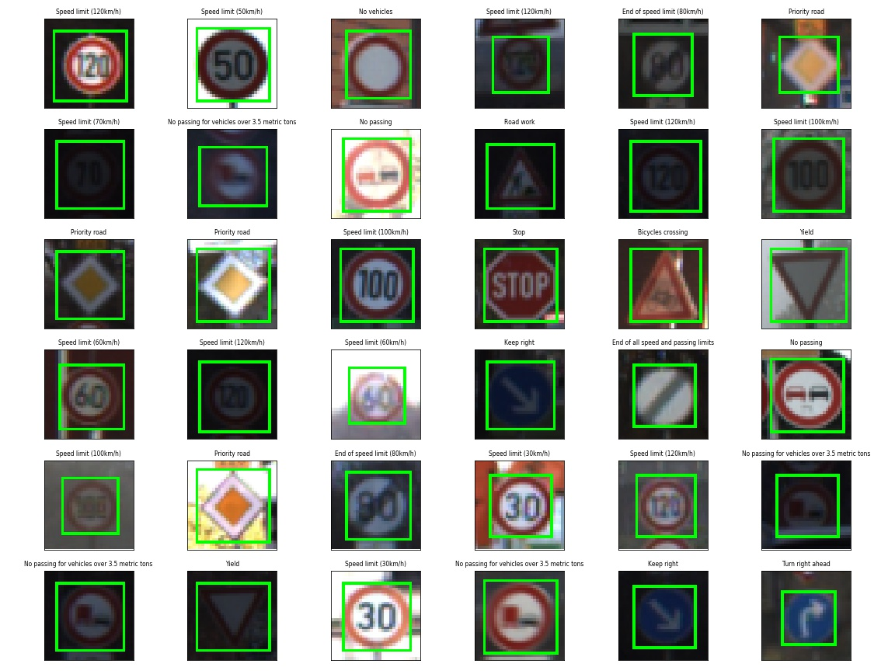
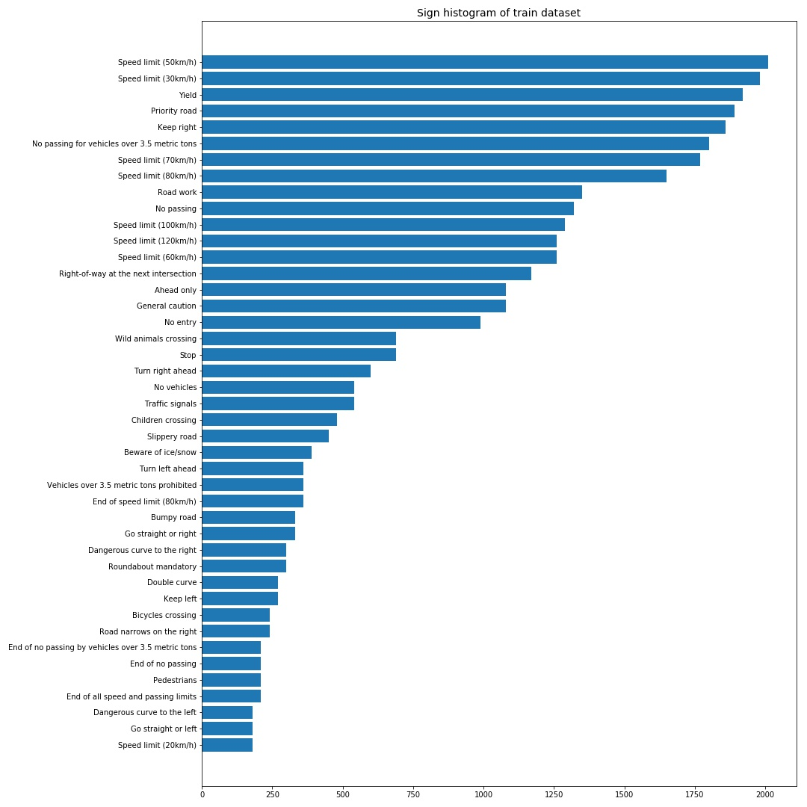
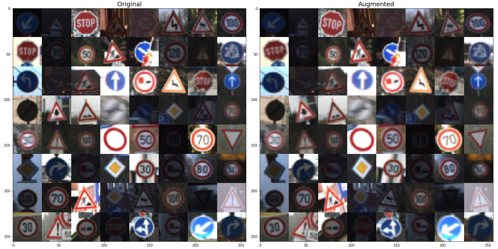
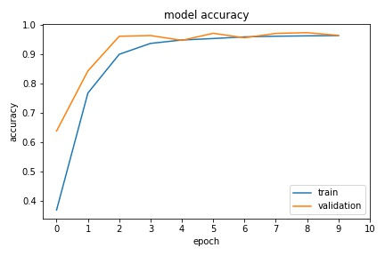
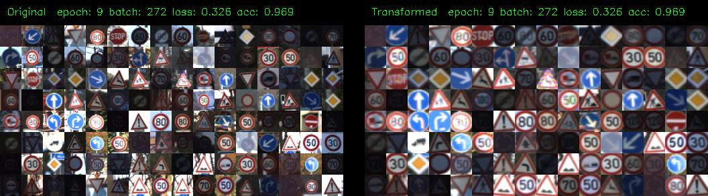
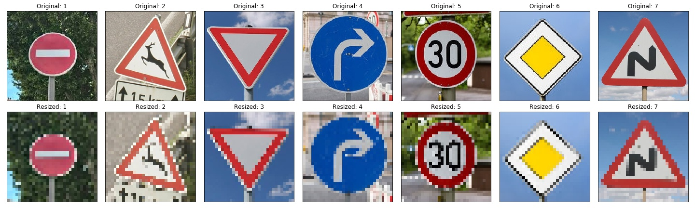
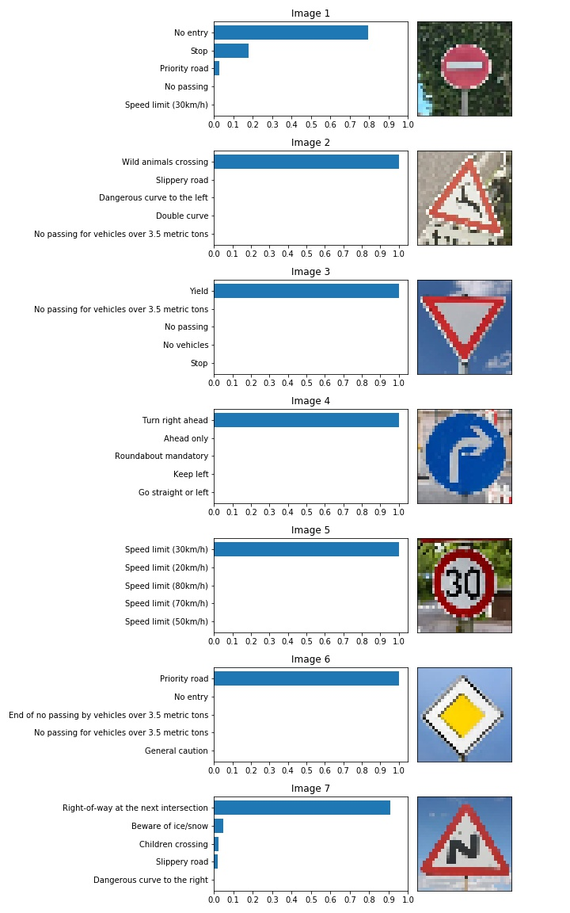
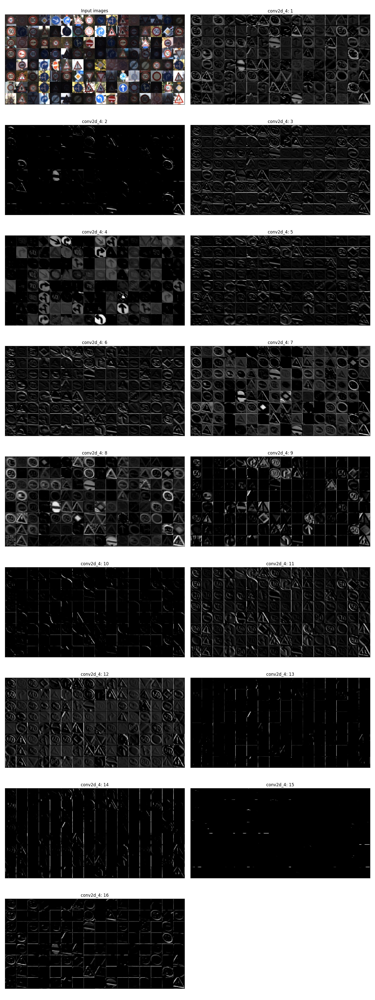

# **Traffic Sign Recognition** 

## Writeup

### You can use this file as a template for your writeup if you want to submit it as a markdown file, but feel free to use some other method and submit a pdf if you prefer.

---

**Build a Traffic Sign Recognition Project**

The goals / steps of this project are the following:
* Load the data set (see below for links to the project data set)
* Explore, summarize and visualize the data set
* Design, train and test a model architecture
* Use the model to make predictions on new images
* Analyze the softmax probabilities of the new images
* Summarize the results with a written report

## Rubric Points
### Here I will consider the [rubric points](https://review.udacity.com/#!/rubrics/481/view) individually and describe how I addressed each point in my implementation.  

---
### Writeup / README

#### 1. Provide a Writeup / README that includes all the rubric points and how you addressed each one. You can submit your writeup as markdown or pdf. You can use this template as a guide for writing the report. The submission includes the project code.

You're reading it!

### Data Set Summary & Exploration

#### 1. Provide a basic summary of the data set. In the code, the analysis should be done using python, numpy and/or pandas methods rather than hardcoding results manually.

I used the pandas library to calculate summary statistics of the traffic
signs data set:

* The size of training set is 34799
* The size of the validation set is 4410 
* The size of test set is 12630
* The shape of a traffic sign image is (32, 32, 3)
* The number of unique classes/labels in the data set is 43

#### 2. Include an exploratory visualization of the dataset.

Here is an exploratory visualization of the data set. It is a bar chart showing the number of data for each class.

- Some images are very dark
- This dataset has a class imbalance
- The number of speed-limit signs is very large

### Design and Test a Model Architecture

#### 1. Describe how you preprocessed the image data. What techniques were chosen and why did you choose these techniques? Consider including images showing the output of each preprocessing technique. Pre-processing refers to techniques such as converting to grayscale, normalization, etc. (OPTIONAL: As described in the "Stand Out Suggestions" part of the rubric, if you generated additional data for training, describe why you decided to generate additional data, how you generated the data, and provide example images of the additional data. Then describe the characteristics of the augmented training set like number of images in the set, number of images for each class, etc.)

As a first step, I normalized the images:

`X_norm = (X - 127.5) / 127.5`

Next, I augmented the original images to make my model more robust. I applied the following transformations to the origial images.
1. Random horizontal and vertical shift (1 ~ 3 pixels)
2. Random rotation (-15 ~ 15 degree)
3. Random scaling (0.9 ~ 1.1)

Here is an example of the original images (left) and the augmented images (right):

#### 2. Describe what your final model architecture looks like including model type, layers, layer sizes, connectivity, etc.) Consider including a diagram and/or table describing the final model.

My final model consisted of the following layers:

| Layer         		|     Description	        									| 
|:----------------------|:--------------------------------------------------------------| 
| Input         		| 32x32x3 normalized RGB image					   				| 
| Spatial transformer   | Transform an input image					                   	|
| Convolution 3 x 3     | 1x1 stride, same padding, relu activation, outputs 32x32x16	|
| Batch normalizaion    | momentum=0.99, epsilon=0.001									|
| Max pooling	      	| 2x2 stride,  outputs 16x16x16 								|
| Convolution 3 x 3     | 1x1 stride, same padding, relu activation, outputs 16x16x32	|
| Batch normalizaion    | momentum=0.99, epsilon=0.001									|
| Max pooling	      	| 2x2 stride,  outputs 8x8x32 									|
| Convolution 3 x 3     | 1x1 stride, same padding, relu activation, outputs 8x8x64		|
| Batch normalizaion    | momentum=0.99, epsilon=0.001									|
| Max pooling	      	| 2x2 stride,  outputs 4x4	x64 								|
| Flatten		      	| outputs 1024					 								|
| Dropout		      	| drop-rate=0.6					 								|
| Fully connected		| outputs 43	       											|
| Softmax				| Final output													|

#### 3. Describe how you trained your model. The discussion can include the type of optimizer, the batch size, number of epochs and any hyperparameters such as learning rate.

My training condition is:
Optimizer: Adam
Learning rate: 0.001
Batch size: 128
epochs: 10

Here's the learning history of my model:

#### 4. Describe the approach taken for finding a solution and getting the validation set accuracy to be at least 0.93. Include in the discussion the results on the training, validation and test sets and where in the code these were calculated. Your approach may have been an iterative process, in which case, outline the steps you took to get to the final solution and why you chose those steps. Perhaps your solution involved an already well known implementation or architecture. In this case, discuss why you think the architecture is suitable for the current problem.

My final model results were:
- Training set accuracy: 96.3 %
- Validation set accuracy: 96.4 %
- Test set accuracy of: 96.2 %

I used the spatial transformer network (STN) propsed by DeepMind in 2015 ([Link](https://arxiv.org/abs/1506.02025)). STN calculates an affine transformation matrix and apply it to an input image to input spatial variations (shift, scaling, and rotaton). STN allows my model to cut off irrelevant background and pay attention to traffic signs to make classification easier.

 

### Test a Model on New Images

#### 1. Choose five German traffic signs found on the web and provide them in the report. For each image, discuss what quality or qualities might be difficult to classify.

Here are seven German traffic signs that I found on the web:

#### 2. Discuss the model's predictions on these new traffic signs and compare the results to predicting on the test set. At a minimum, discuss what the predictions were, the accuracy on these new predictions, and compare the accuracy to the accuracy on the test set (OPTIONAL: Discuss the results in more detail as described in the "Stand Out Suggestions" part of the rubric).

Here are the results of the prediction:

| Image			        |     Prediction	        					| 
|:----------------------|:----------------------------------------------| 
| No entry		      	| No entry   									| 
| Wild animals crossing | Wild animals crossing 						|
| Yield					| Yield											|
| Turn right ahead	    | Turn right ahead				 				|
| Speed limit (30km/h)	| Speed limit (30km/h)			 				|
| Priority road			| Priority road      							|
| Double curve			| Right-of-way at the next intersection			|

The model was able to correctly guess 6 of the 7 traffic signs, which gives an accuracy of 85.7%.

#### 3. Describe how certain the model is when predicting on each of the five new images by looking at the softmax probabilities for each prediction. Provide the top 5 softmax probabilities for each image along with the sign type of each probability. (OPTIONAL: as described in the "Stand Out Suggestions" part of the rubric, visualizations can also be provided such as bar charts)

My model has a very high confidence (> 80 %) for all the predition results.

### (Optional) Visualizing the Neural Network (See Step 4 of the Ipython notebook for more details)
#### 1. Discuss the visual output of your trained network's feature maps. What characteristics did the neural network use to make classifications?

The figure below shows the featuremaps of the first convolution layer in my model.
- The 4th filter (cnv2d_4: 4) has high activations to arrow signs
- The 9th filter (cnv2d_4: 9) has high activations to bright images
- This layer seems to have high activations to the outer boundary and mark of traffic signs.

